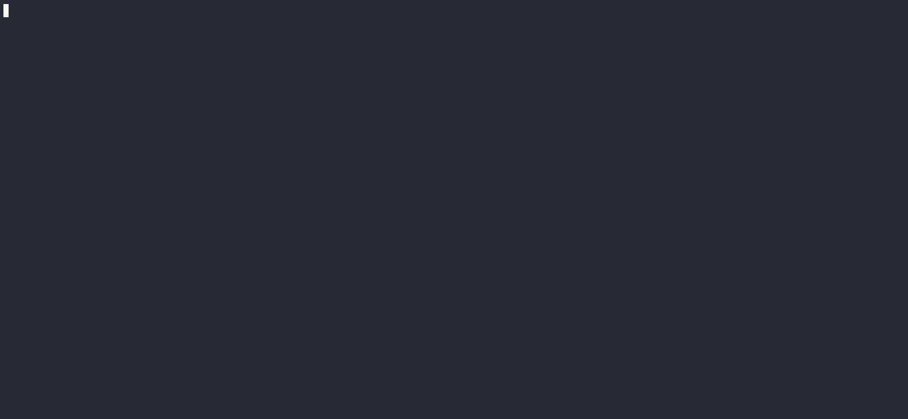
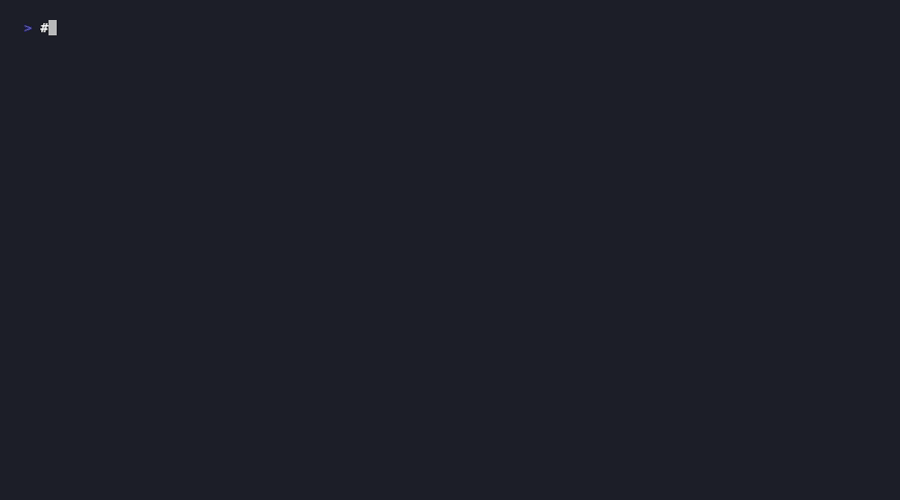
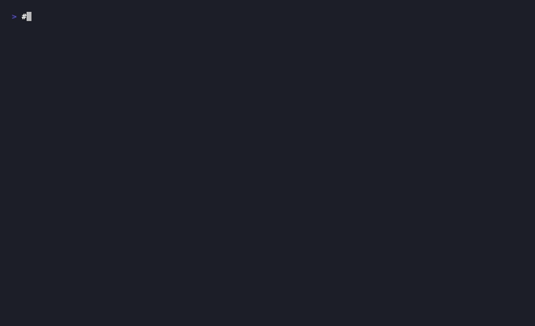

<p align="center">
  
</p>

<h1 align="center">ghtml</h1>

<p align="center">
  <strong>Write HTML templates. Get type-safe Gleam. Like magic.</strong> ✨
</p>

<p align="center">
  <a href="https://github.com/burakcorekci/ghtml/actions/workflows/test.yml"></a>
  <a href="https://hex.pm/packages/ghtml"></a>
  <a href="https://hexdocs.pm/ghtml/"></a>
  <a href="LICENSE"></a>
</p>

<p align="center">
  
</p>

---

## The Problem

Ever found yourself writing Lustre views like this? 😩

```gleam
html.div([attribute.class("card")], [
  html.div([attribute.class("card-header")], [
    html.h1([attribute.class("title")], [text(user.name)]),
    html.span([attribute.class("badge")], [text("Admin")]),
  ]),
  html.div([attribute.class("card-body")], [
    html.p([], [text(description)]),
    // wait, did I close all the brackets...?
  ]),  // <-- is this right?
])     // <-- or this one?
```

Bracket-counting nightmares. We've all been there. 🤯

## The Solution

Write this instead:

```html
@params(user: User, description: String)

<div class="card">
  <div class="card-header">
    <h1 class="title">{user.name}</h1>
    <span class="badge">Admin</span>
  </div>
  <div class="card-body">
    <p>{description}</p>
  </div>
</div>
```

Run `gleam run -m ghtml` and boom — you get a perfectly formatted, type-safe Gleam module. 🎉

---

## Quick Start

**1. Install**

```sh
gleam add ghtml@1
```

**2. Create a template**

Create `src/components/greeting.ghtml`:

```html
@params(name: String)

<div class="greeting">
  <h1>Hello, {name}!</h1>
</div>
```

**3. Generate**

```sh
gleam run -m ghtml
```

**4. Use it**

```gleam
import components/greeting

pub fn view(model: Model) -> Element(Msg) {
  greeting.render(model.name)
}
```

That's it. You're done. Go grab a coffee. ☕

---

## Features

### ⚡ Blazing Fast

Hash-based caching means we only rebuild what changed. Run it a thousand times — if nothing changed, nothing rebuilds.

<p align="center">
  
</p>

### 👀 Watch Mode

Change a file. Blink. It's regenerated. Your flow stays unbroken.

<p align="center">
  
</p>

### 🎯 Control Flow

`{#if}`, `{#each}`, `{#case}` — all the control flow you need, right in your templates.

```html
{#if user.is_admin}
  <span class="badge">Admin</span>
{/if}

{#each items as item}
  <li>{item}</li>
{/each}
```

### 🧹 Auto Cleanup

Delete a `.ghtml` file and we clean up the generated `.gleam` file automatically. No orphans left behind.

<p align="center">
  
</p>

Outside of watch mode, you can manually remove orphaned files:

```sh
gleam run -m ghtml -- clean
```

### 🎨 Events

Event handlers? We got 'em.

```html
<button @click={on_save}>Save</button>
<input @input={handle_input} />
```

### 🔧 Custom Elements

Web components work too. Tags with hyphens automatically use `element()`.

```html
<my-component data={value}>
  <slot-content />
</my-component>
```

---

## Template Syntax

<p align="center">
  
</p>

<details>
<summary><strong>📦 Imports & Parameters</strong></summary>

```html
@import(gleam/int)
@import(app/models.{type User})

@params(
  user: User,
  count: Int,
  on_click: fn() -> msg,
)
```

</details>

<details>
<summary><strong>✨ Interpolation</strong></summary>

```html
<!-- Expressions -->
<p>{user.name}</p>
<p>{int.to_string(count)} items</p>

<!-- Literal braces -->
<p>Use {{ and }} for literal braces</p>
```

</details>

<details>
<summary><strong>🔀 Control Flow</strong></summary>

```html
<!-- Conditionals -->
{#if show}
  <p>Visible!</p>
{:else}
  <p>Hidden</p>
{/if}

<!-- Loops -->
{#each items as item, index}
  <li>{int.to_string(index)}: {item}</li>
{/each}

<!-- Pattern matching -->
{#case status}
  {:Active}
    <span class="green">Active</span>
  {:Pending}
    <span class="yellow">Pending</span>
{/case}
```

</details>

<details>
<summary><strong>🎯 Attributes & Events</strong></summary>

```html
<!-- Static attributes -->
<div class="container" id="main">

<!-- Dynamic attributes -->
<input value={model.text} placeholder={hint} />

<!-- Boolean attributes -->
<input disabled required />

<!-- Events -->
<button @click={on_submit}>Submit</button>
<input @input={handle_change} @blur={on_blur} />
```

</details>

---

## Example

**Input:** `src/components/user_card.ghtml`

```html
@import(gleam/int)
@params(name: String, count: Int)

<div class="card">
  <h1>{name}</h1>
  <p>{int.to_string(count)} items</p>
</div>
```

**Output:** `src/components/user_card.gleam`

```gleam
// @generated from user_card.ghtml
// @hash abc123...
// DO NOT EDIT - regenerate with: gleam run -m ghtml

import gleam/int
import lustre/attribute
import lustre/element.{type Element, text}
import lustre/element/html

pub fn render(name: String, count: Int) -> Element(msg) {
  html.div([attribute.class("card")], [
    html.h1([], [text(name)]),
    html.p([], [text(int.to_string(count) <> " items")]),
  ])
}
```

---

## Commands

| Command | What it does |
|---------|--------------|
| `gleam run -m ghtml` | Generate all (skips unchanged) |
| `gleam run -m ghtml -- force` | Force regenerate everything |
| `gleam run -m ghtml -- watch` | Watch mode |
| `gleam run -m ghtml -- clean` | Remove orphans only |

---

## Documentation

- 📖 [**Full Documentation**](https://hexdocs.pm/ghtml/) — API reference and guides
- 🤝 [**Contributing**](CONTRIBUTING.md) — Development setup and guidelines
- 📁 [**Examples**](examples/) — Working example projects

---

## Made for Lustre 💖

This tool is built specifically for the [Lustre](https://github.com/lustre-labs/lustre) ecosystem. If you're building web apps with Gleam, you're in the right place.

---

<p align="center">
  <sub>Built with ☕ and too many brackets by <a href="https://github.com/burakcorekci">@burakcorekci</a></sub>
</p>
